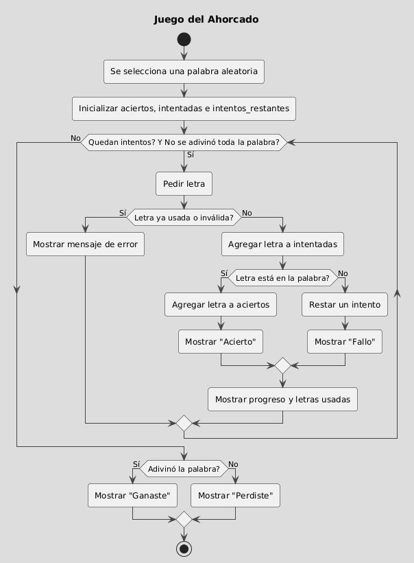

# Ahorcado-Autonomo2

## Descripción
El juego trata de adivinar una palabra aleatoria ingresando una letra a la vez.  
## Tecnologías
- Python 3.11.3
- Libreria usada: `random` (es parte de la libreria estandar de python)
## Características
- Seleccion de una palabra aleatoria
- Conteo de intentos restantes
- Informacion visual sobre letras acertadas en la palabra
- Listado de letras falladas
- Manejo de letras repetidas
## Diagrama de Flujo


## Instalación y uso del repositorio
prerrequisito: tener instalado python  
Podemos clonar el repositorio con el comando  
`git clone https://github.com/JUANCH1I/Ahorcado-Autonomo2.git`  
 o descarcargando el ZIP del repositorio  
Luego de descomprimir el archivo ZIP o de terminar la clonacion te vas a encontrar con el archivo ahorcado.py que lo podes ejecutar en tu consola con el comando `python ahorcado.py`

## Como funciona este juego
Al iniciar el programa te va a solicitar que ingreses una palabra hasta que aciertes la palabra o te quedes sin intentos.  
El juego te va indicando:
- Los intentos que te quedan.
- Cuantas letras acertaste.
- Cuales fallaste.

## Ejemplo de Interfaz
```
¡Bienvenido al Ahorcado!
Tienes 6 intentos.
_ _ _ _ _ _ _ _ _
Ingresa una letra:
```
## Posibles mejoras
- Crear una interfaz gráfica.
- Guardar la puntuación del usuario de forma local.
- Agregar diferentes dificultades cambiando el largo de la palabra y disminuyendo la cantidad de intentos.
## Video Explicativo del codigo
Puedes ver el funcionamiento del juego y su explicación en el siguiente enlace:  
[Ver video en Google Drive](https://drive.google.com/file/d/1Xpqq2zs95cEpq3y_wGVLzihEa8Hq3oMI/view?usp=sharing)
## Notas
implemente algunas cosas más como funciones o estructuras de datos debido a que estoy un poquito adelantado debido a otros proyectos que tengo.
## Conclusiones
- Gracias a este proyecto pude familiarizarme con la sintaxis de Python.  
- Aprendí a diseñar un README con el lenguaje de markdown.  
- Pude simplificar el código gracias al descubrimiento de la estructura `set` que evita duplicados, gracias a esto se logró evitar la comprobación de letras repetidas de forma manual.  
- Al principio no me acostumbraba a la sintaxis sin llaves y que funciona por tabulaciones, lo que me generaba muchos errores. Realmente prefiero lenguajes que utilizan llaves porque me parecen códigos mas legibles y faciles de ordenar.
## Autor
Juan Ignacio Manfredi  
Universidad internacional del Ecuador
